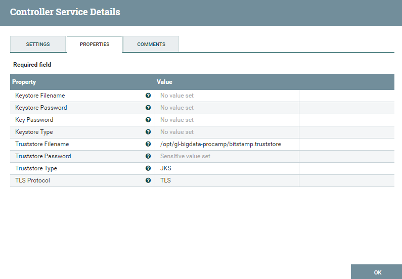
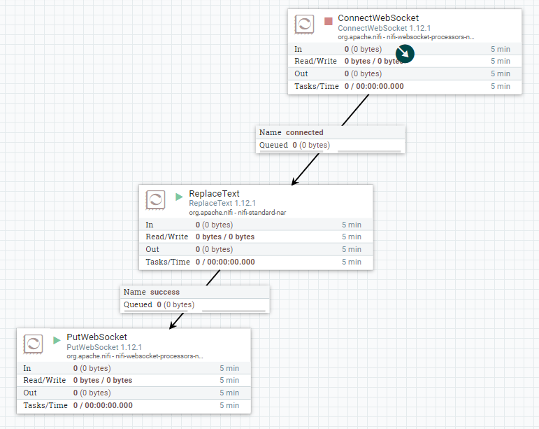

# Data Ingestion with Apache NiFi #

Apache NiFi. Apache NiFi is a software project from the Apache Software Foundation designed to automate the flow of data between software systems.

In this lab you will connect to [bitstamp.net](https://bistamp.net) WebSocket to consume bitcoin live orders using WebSocket API https://www.bitstamp.net/websocket/v2/

## Objectives ##
- explore NiFi on a DataProc clsuter
- subscribe to the BitStamp WebSocket
- start consumption

## Exercise 1: Setting up a local environment to work with Google Cloud ##


### Task 1: Make tunnel to the Cloud environment

1. Go to your DataProc cluster, WEB INTERFACES tab, then "Create an SSH tunnel to connect to a web interface"

2. Choose your host OS on a laptop from the tabs: "Linux\MacOS\Windows" and excute command under "Create an SSH tunnel using local port 1080"
3. Run command under "Run Chrome and connect through the proxy"
NB! For the x64 Windows please replace "%ProgramFiles(x86)%\Google\Chrome\Application\chrome.exe ^"
with ""C:\Program Files (x86)\Google\Chrome\Application\chrome.exe" ^"

This would open web UI on the port 8088. Edit your browser navigation URL with the port 8081.

### Task 2: Verifing NiFi

Componet       | URL
---------------|----------------------------
Apache NiFi    | http://dataproc_cluster_name:8081/nifi/


## Excersice 2: Data Ingestion from Bitstamp Websocket ##

### Task 1: Subscribing to Bitstamp Websocket

1. Navigate your web browser to http://dataproc_cluster_name:8081/nifi/
    

2. Right click on a blank space, click "Configure" and navigate to "Controller Services" tab.
    

3. Add **StandardRestrictedSSLContextService** service. Configure it with any name and set the following properties:

Property            | Value
--------------------|-------------------------------
Truststore Filename | /opt/gl-bigdata-procamp/bitstamp.truststore
Truststore Password | truststore
Truststore Type     | JKS



4. Add **JettyWebSocketClient** service. Configure it with any name and set the following properties:

Property            | Value
--------------------|-------------------------------
WebSocket URI       | wss://ws.bitstamp.net
SSL Context Service | BitstampSSLContextService


5. Navigate back to the start page, right click on a blank space and select "Variables" menu item.

Name         | Value
-------------|-------------------------------
CurrencyPair | btcusd


6. Build the flow to subscribe on orders channel.

Navigate back to the start page, put the following processors on the surface:

Processor Type   | Name
-----------------|----------------------------------
ConnectWebSocket | Connect to Bitstamp
ReplaceText      | Prepare channel subscription message
PutWebSocket     | Send channel subscription message

Connect processors to make the flow

From                         | To                                   | Relationships
-----------------------------|--------------------------------------|-------------
Connect to Bitstamp          | Prepare channel subscription message | connected
Prepare channel subscription | Send channel subscription message    | success

Configure processors:

Processor **Connect to Bitstamp**

Property                           | Value
-----------------------------------|------------------------
WebSocket Client ControllerService | BitstampWebSocketClient
WebSocket Client Id                | BitstampIngestionClient

Processor **Prepare channel subscription message**

Property     | Value
-------------|------
Search Value | .*

Set property "Replacement Value":

```json
{
    "event": "bts:subscribe",
    "data": {
        "channel": "live_orders_${CurrencyPair}"
    }
}
```

Processor **Send channel subscription message**

Property                       | Value
-------------------------------|-----------------------------------
WebSocket Session Id           | ${websocket.session.id}
WebSocket ControllerService Id | ${websocket.controller.service.id}
WebSocket Endpoint Id          | ${websocket.endpoint.id}
WebSocket Message Type         | TEXT


Configure **Automatically Terminate Relationships** property for every non used connection




9. Start every processor
